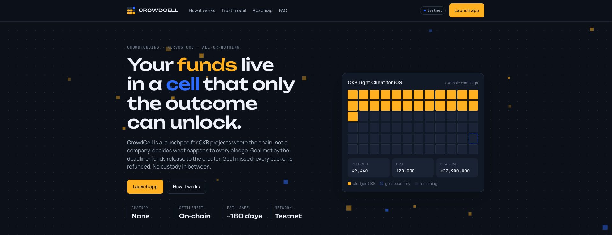

# CrowdCell

**All-or-nothing crowdfunding on Nervos CKB, settled by on-chain scripts.**

A pledge sits in its own cell that only the outcome can unlock. Goal met by the deadline: the funds go to the creator. Goal missed: every backer is refunded. Nobody holds the money in between, and there is no admin key.

[**Try it on testnet →**](https://crowdcell.vercel.app) · [Nervos Talk thread](https://talk.nervos.org/t/introducing-ckb-kickstarter-decentralized-all-or-nothing-crowdfunding-on-nervos-ckb-testnet-mvp-live/10130) · [@crowdcellckb](https://x.com/crowdcellckb)

[](https://crowdcell.vercel.app)

> **Status: testnet preview.** CrowdCell runs on the CKB testnet with test CKB only. The contracts have been reviewed by CKB developers but have not had an independent audit yet, which is planned before mainnet.

## How it works

CKB stores state in cells. CrowdCell uses that literally: a campaign is a cell, each pledge is a cell, and the scripts guarding them allow only the settlement paths below.

1. **Create.** A creator publishes a campaign cell with a funding goal in CKB and a deadline block. Neither can be changed afterwards.
2. **Pledge.** A backer locks CKB into a pledge cell, and the campaign's on-chain total goes up in the same transaction. A receipt cell lands in the backer's wallet as proof.
3. **Settle.** After the deadline the campaign is finalized against its on-chain total, then every pledge is released to the creator or refunded to its backer. A finalization bot does this automatically, and anyone else can too.

If a pledge is still unsettled about 180 days after the deadline, anyone can send it back to its backer without the campaign cell at all, so nothing can get stuck.

## What each party can do

"Trustless" is a specific claim. This is what the scripts allow:

| Action | Creator | Backer | Anyone | Enforced by |
|---|:---:|:---:|:---:|---|
| Pledge to a campaign (before the deadline, 100 CKB minimum) | ✓ | ✓ | ✓ | campaign + pledge type scripts |
| Finalize as Funded or Unsuccessful (after the deadline) | if it matches the total | if it matches the total | if it matches the total | campaign type script |
| Release funds to the creator (only once Funded) | ✓ | ✓ | ✓ | pledge lock script |
| Refund a backer (only once Unsuccessful) | ✓ | ✓ | ✓ | pledge lock script |
| Send funds anywhere else | ✗ | ✗ | ✗ | pledge lock script |
| Return an unsettled pledge to its backer (~180 days after the deadline) | ✓ | ✓ | ✓ | pledge lock script |
| Reclaim a receipt's deposit (once finalized) | ✗ | their own | ✗ | receipt type script |

Campaigns reference the scripts by the hash of their code, so nobody can upgrade them under a live campaign.

## Repository layout

```
contracts/                    Rust + ckb-std, compiled to RISC-V for CKB-VM
  campaign/                   type script: campaign state, on-chain total, finalization
  campaign-lock/              lock script: who may spend the campaign cell, and when
  pledge/                     type script: pledge creation and merging
  pledge-lock/                lock script: release, refund and the fail-safe
  receipt/                    type script: backer receipts
off-chain/
  transaction-builder/        TypeScript + CCC: builds every transaction, deploy and test scripts
  indexer/                    Express + SQLite: indexes cells, serves the API, runs the finalization bot
  frontend/                   Next.js: landing page and the app
e2e/                          browser test scenarios
scripts/build-contracts.sh    builds all five contracts
```

## Testnet deployment

Deployed 2026-09-17. Each link is the transaction that holds the contract code.

| Contract | Code hash | Deployment |
|---|---|---|
| campaign | `0x1d9b9e5959c932c0ff6486e03cd69d0e51a6b087dacf80b909c23d713bd2659c` | [tx](https://pudge.explorer.nervos.org/transaction/0x609fbcf58825e83af21e2a5cc28d3f217d5019be75290e6f60455cf3de9ca1ba) |
| campaign-lock | `0xb6e2b333d0f38a89c70cde6558670b771244695d33daa1fa62385017476401bf` | [tx](https://pudge.explorer.nervos.org/transaction/0xc4e8aaaefd921550daa21222cebeccaad7fd5d178d4df567d94c9248a5c149b6) |
| pledge | `0xe45d09f08d0e842340afb004cfb6b6b6414ad387f9cd2f3e0b9abcd6ae8eb024` | [tx](https://pudge.explorer.nervos.org/transaction/0xcf0d6069aa261109704bcabe70d65c3cddddd8c0605fadd12fa0378f2fdb33cf) |
| pledge-lock | `0xc28d8042a1cf39d02db0cbc769a26faad80b39563c2d2de40536ddb66ae3a525` | [tx](https://pudge.explorer.nervos.org/transaction/0x1dc0f07d3acd90823932aca7034209cbf5d1bd8ba5c9310ea9bb55b7c0a0beb2) |
| receipt | `0x2bac36d4cadd65b66c25557d37c2bba4f7e3c40a94ca92f3853b311887dba575` | [tx](https://pudge.explorer.nervos.org/transaction/0x63d545b60d5eb9680230f8822f597d70f76cfab5e738d9118a977836e317b967) |

## Run it locally

You need Node.js, Rust (the toolchain is pinned in `rust-toolchain.toml`), `riscv64-elf-gcc` and [OffCKB](https://github.com/ckb-devrel/offckb) for a local devnet.

```bash
# 1. Start a local CKB devnet
offckb node

# 2. Build the contracts
./scripts/build-contracts.sh

# 3. Deploy them (devnet by default)
cd off-chain/transaction-builder && npm install
npx ts-node deploy-contracts.ts

# 4. Start the indexer (http://localhost:3001)
cd ../indexer && npm install
cp .env.example .env
npm run dev

# 5. Start the frontend (http://localhost:3000)
cd ../frontend && npm install
cp .env.example .env.local
npm run dev
```

Set the contract code hashes printed by the deploy step in both `.env` files if they differ from the defaults.

## Tests

```bash
# Contract unit tests
cd contracts/campaign && cargo test
cd contracts/campaign-lock && cargo test

# Full lifecycle and exploit attempts against a running devnet
cd off-chain/transaction-builder
npx ts-node test-v1.1-lifecycle.ts
npx ts-node test-v1.2-exploits.ts
```

Browser scenarios are described in [`e2e/`](e2e/README.md).

## Roadmap

- **Live on testnet:** all-or-nothing campaigns settled on-chain, automatic finalization, release and refund, receipts and the ~180-day fail-safe.
- **Next:** a creator dashboard for your campaigns and a backer dashboard for your pledges and deposits.
- **Then:** an independent security audit and launch on CKB mainnet.
- **Later:** pledging from a Bitcoin wallet through RGB++.

## Feedback

Issues and pull requests are welcome. For questions or ideas, open an issue here or reply on the [Nervos Talk thread](https://talk.nervos.org/t/introducing-ckb-kickstarter-decentralized-all-or-nothing-crowdfunding-on-nervos-ckb-testnet-mvp-live/10130).
